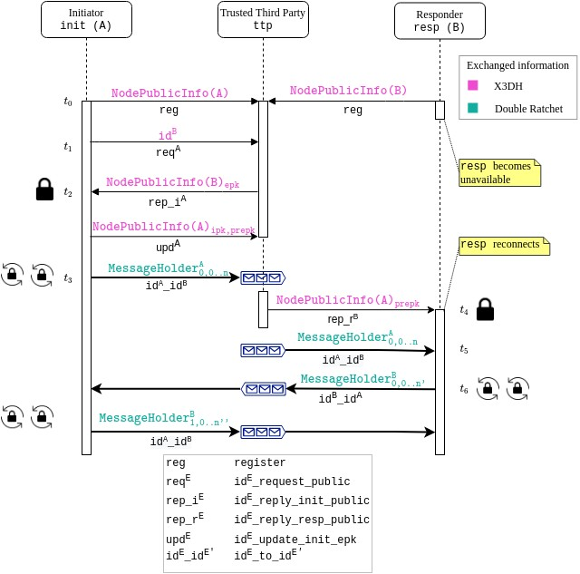

# README

> Work in progress 

The way `simple_handshake_chaining.py` operates is illustrated in the following image.

-------------

## Requirements

* python-3.7 (perhaps with 3.8 would work as well);
* docker-compose.

--------------

## Building instructions 

`pip install -r requirements.txt`
`./start_up.sh # starts the RabbitMQ broker` 

Open a new terminal and run:

`python ttd.py # runs the Trusted Third Party`

Run `alice.py` and `bob.py` in two different terminals. 

`python alice.py`
`python bob.py`

You can observe the message exchange executed over [RabbitMQ](https://www.rabbitmq.com/), with the AMQP protocol. 

Alice and bob scripts provide with a very basic CLI for sending/receiving messages to each other. `ttd.py` shows the logs of the Trusted Third Party.

----------------

## Design

----------------

## Next steps

* ~~Sketch documentation of the transport~~;
* ~~Transport layer~~;
* ~~Basic GUI~~;
* ~~X3DH~~;
* ~~Double Ratchet~~:

  * ~~Asymmetric Ratchet~~;
  * ~~Symmetric Ratchet~~; 
  
* Improved documentation and comments. [`in_progress`]

